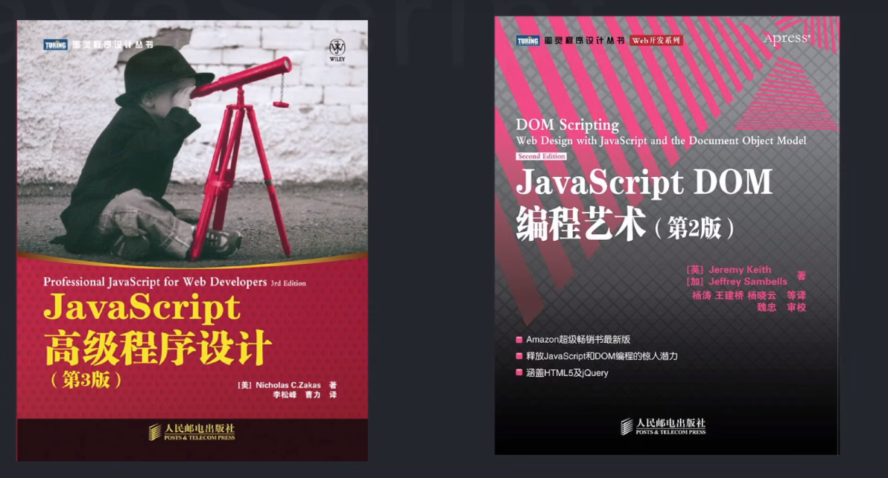

## 参考
<https://www.w3docs.com/learn-css.html>

### 难点： 长度单位 em,px 等的区别

### 难点：选择器的定义感觉还挺复杂的。
tbody tr:nth-child(even){}这样的定义。 (https://www.w3docs.com/learn-css/css-tables.html)

### css 中 元素的排布，浮动，flex等还没吃透。

### :nth-child()说明与使用 总结

### 背景颜色设置
比如 `background-image: radial-gradient( #ff0509 10%, #fff700 20%, #05ff33 80%);` 代表什么意思。
参考：<https://developer.mozilla.org/en-US/docs/Web/CSS/gradient/linear-gradient>

### 总结 css与html中块级元素和inline级元素。以后便于查表。
比如： span和div一样，都是空元素，一个是inline，一个是block的。便于css控制？？

## blibli视频 内容总结
https://github.com/kamranahmedse/developer-roadmap
https://roadmap.sh/frontend

https://objtube.github.io/front-end-roadmap/#/

### 阶段1
学习html和css，视频的up主推荐使用菜鸟教程（但是，我不想用这个网站。）
找个网站去模仿，比如淘宝的主页，可以让css成长很快。

### 阶段2 学习js
js必须要掌握熟练，因为大部分时间都是在写js。
先掌握基础语法
然后dom编程 和ajax发送网络请求等。
推荐书籍

 **切记不要使用jquery vue react 这样帮助操作dom的库，等js基础打好后再使用**
 先不要学习bootstap，而是先打好css基础
 不要学会后就不管了，要反复使用学会的东西才行。

 ### 阶段3 提升阶段，使用 node.js 提高开发效率
 对与初学者，把nodejs当做辅助学习前端的工具使用。

 ### 阶段4， 学习库，vue, react 等。
 基础打牢之后，推荐深入学习某个框架，up主推荐深入学习vue
 vue + vue-router + vuex
 同样 对于 react 有
 react + react-dom + react-router + reactx
